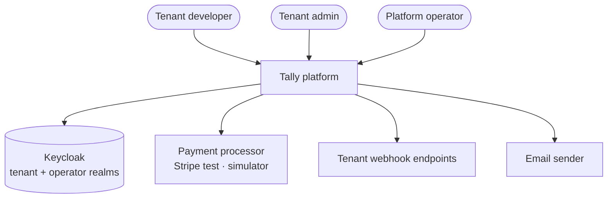
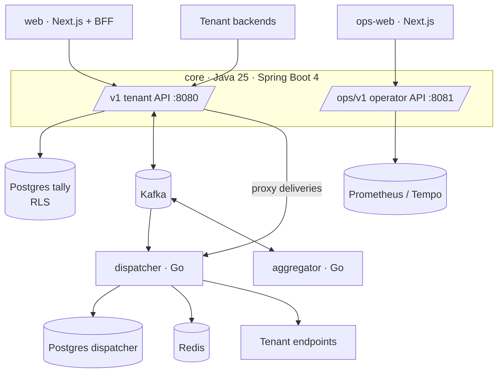

# Software Architecture Document — Tally

Version 1.0 · 2026-09-22 · Owner: Tech lead

## 1. Scope

Covers the five deployables (core, dispatcher, aggregator, web, ops-web), their data stores, the contracts between them, runtime behavior under success and failure, cross-cutting rules and deployment. Real-world mapping: *tenant* = a SaaS company using Tally; *customer* = the tenant's own customer; *operator* = Tally staff; *processor* = Stripe test mode or the in-repo simulator standing in for a card acquirer.

## 2. Architecture drivers

### 2.1 Functional requirements

| ID | Requirement | Epic |
| --- | --- | --- |
| FR-TEN-01 | Operator creates a tenant; provisioning (config, roles, credentials) is idempotent | E1 |
| FR-TEN-02 | Each tenant has an `isolation_tier` (POOL default) and a plan version driving quotas/features | E1 |
| FR-TEN-03 | Suspended tenants: read-only API, no webhook delivery | E8 |
| FR-TEN-04 | Tenants create/list/revoke scoped API keys, shown once, stored hashed | E1 |
| FR-TEN-05 | Dashboard login via Keycloak; switching tenant mints a new token | E1 |
| FR-TEN-06 | Tenant can export all its data | E9 |
| FR-TEN-07 | Offboarding deletes data and destroys the tenant's keys (crypto-shred) | E9 |
| FR-CUS-01 | Create/update customers (email, name, currency, metadata) | E4 |
| FR-CUS-02 | Payment methods stored only as processor tokens | E4 |
| FR-CUS-03 | Customer email unique per tenant | E4 |
| FR-CAT-01 | Products and prices: flat, per-seat, metered (per-unit, graduated tiers) | E4 |
| FR-CAT-02 | Prices immutable once used; changes create a new version | E4 |
| FR-CAT-03 | Monthly and yearly intervals, one currency per price | E4 |
| FR-CAT-04 | Each price version shows active subscription count | E4 |
| FR-SUB-01 | Create subscription with items and optional trial | E5 |
| FR-SUB-02 | States TRIALING/ACTIVE/PAST_DUE/CANCELED; only legal transitions | E5 |
| FR-SUB-03 | Mid-cycle changes produce prorated lines | E5 |
| FR-SUB-04 | Cancel now or at period end | E5 |
| FR-SUB-05 | Test clocks advance time for test-mode subscriptions | E5 |
| FR-SUB-06 | Side-effect-free price and proration preview | E5 |
| FR-MET-01 | Usage events via API, single or batch | E6 |
| FR-MET-02 | Duplicate `event_id` counted once | E6 |
| FR-MET-03 | Late events included until period close, then per-meter policy | E6 |
| FR-MET-04 | Current-period usage per customer and meter | E6 |
| FR-MET-05 | Threshold alert event when a customer crosses a quantity | E6 |
| FR-INV-01 | Period-end drafts from subscription items + closed usage | E5 |
| FR-INV-02 | Drafts editable; finalized immutable | E5 |
| FR-INV-03 | Finalize posts receivable to ledger in the same transaction | E5 |
| FR-INV-04 | Gap-free sequential invoice numbers per tenant | E5 |
| FR-INV-05 | Void = reversing ledger entries | E5 |
| FR-INV-06 | Credit notes reduce amount due | E5 |
| FR-INV-07 | Bulk payment reminders | E5 |
| FR-PAY-01 | Payment requests require an idempotency key | E7 |
| FR-PAY-02 | Processor port with ≥ 2 adapters | E7 |
| FR-PAY-03 | Async processor outcomes reconciled into final state | E7 |
| FR-PAY-04 | Configurable dunning; exhausted → PAST_DUE | E7 |
| FR-PAY-05 | Full/partial refunds post reversing entries | E7 |
| FR-PAY-06 | Daily processor ↔ ledger reconciliation | E7 |
| FR-LED-01 | Journal entries of ≥ 2 postings summing to zero per currency | E2 |
| FR-LED-02 | Postings append-only; corrections are reversals | E2 |
| FR-LED-03 | Balances per account as of any time | E2 |
| FR-LED-04 | Each entry references its business cause | E2 |
| FR-WH-01 | Register endpoints with URL and event types | E3 |
| FR-WH-02 | HMAC-SHA256 signature over timestamp and raw body | E3 |
| FR-WH-03 | Secret rotation with overlap window | E3 |
| FR-WH-04 | Exponential backoff + jitter up to max age | E3 |
| FR-WH-05 | Auto-disable after continuous failure; tenant notified | E3 |
| FR-WH-06 | View attempts; replay any event incl. DLQ | E3 |
| FR-WH-07 | Reject URLs resolving to private/internal addresses | E3 |
| FR-OPS-01 | Time-bounded, reason-logged, tenant-visible impersonation | E8 |
| FR-OPS-02 | Immutable audit log of state-changing actions | E1 |
| FR-OPS-03 | Pool → silo migration without downtime | E9 |
| FR-KEY-01 | API key secret returned once; prefix + last4 stored | E1 |
| FR-KEY-02 | Revocation effective within 5 s everywhere | E1 |
| FR-EVT-01 | Events queryable 30 days with per-endpoint status | E3 |
| FR-EVT-02 | API request log 14 days, filterable | E3 |
| FR-SET-01 | Team invitations with roles, 7-day expiry | E1 |
| FR-SET-02 | Tenant branding on invoices, receipts, emails | E1 |
| FR-SET-03 | Tenant sees plan, limits and usage | E1 |
| FR-DASH-01 | Home attention items dismissible per user | E7 |
| FR-ADM-TEN-01..08 | Operator tenant search, views, detail, reason-gated data, suspend (4-eyes), plan change, offboarding, silo migration | E8, E9 |
| FR-ADM-IMP-01..05 | Read-only impersonation ≤ 60 min; write needs approval; auto-expiry; actor attribution; tenant visibility | E8 |
| FR-ADM-MON-01..05 | Reconciliation view/resolve; threshold refunds; ledger explorer; revenue overview | E8 |
| FR-ADM-OPS-01..06 | Health view; top tenants by load; fleet view; bulk DLQ replay with dry run; job monitor; idempotent re-run | E8 |
| FR-ADM-CFG-01..03 | Versioned plans and limits; targeted flags; diff + affected count before save | E8 |
| FR-ADM-GOV-01..05 | Four-eyes queue; stored-payload execution with 24 h expiry; complete audit; role grants via approval; audit export | E8 |

### 2.2 Quality attribute scenarios

| ID | Attribute | Scenario | Measure |
| --- | --- | --- | --- |
| NFR-COR-01 | Correctness | Any sequence of postings is committed | 100 % of entries balance per currency (deferred constraint + property tests) |
| NFR-COR-02 | Correctness | Relay or broker killed mid-load | 0 lost integration events (outbox rows = consumed) |
| NFR-COR-03 | Correctness | Payment/usage/rollup delivered twice | Exactly-once effect |
| NFR-COR-04 | Correctness | Code review of money packages | 0 `double`/`float`/`BigDecimal` amounts (ArchUnit) |
| NFR-COR-05 | Correctness | Daily reconciliation | 0 unexplained differences |
| NFR-SEC-01 | Security | Any tenant endpoint called with another tenant's ids | 0 cross-tenant reads/writes (generated IDOR suite) |
| NFR-SEC-02 | Security | Forged tenant header/body | Ignored; tenant from credential only |
| NFR-SEC-03 | Security | Card data | Never stored, logged or transmitted (tokens only) |
| NFR-SEC-04 | Security | Keys and secrets at rest | Hashed/encrypted; never logged (log scan in CI) |
| NFR-SEC-05 | Security | Tenant offboarded | Data unreadable after key destruction |
| NFR-SEC-06 | Security | Endpoint URL → private IP, metadata, DNS rebinding | Blocked at dial time |
| NFR-PER-01 | Performance | Write APIs at 200 rps sustained | p99 < 200 ms |
| NFR-PER-02 | Performance | Read APIs at 500 rps | p99 < 100 ms |
| NFR-PER-03 | Performance | Usage ingest | 5,000 ev/s accepted, p99 < 50 ms |
| NFR-PER-04 | Performance | Ledger | 1,000 entries/s, 0 violations |
| NFR-PER-05 | Performance | Commit → first webhook attempt (healthy endpoint) | p95 < 5 s |
| NFR-PER-06 | Performance | Outbox relay lag | p99 < 1 s |
| NFR-FAIR-01 | Fairness | One tenant = 50 % of traffic | Others' p99 degrades ≤ 20 % |
| NFR-FAIR-02 | Fairness | Tenant endpoint down 6 h with backlog | Others' webhook p95 degrades ≤ 10 % |
| NFR-FAIR-03 | Fairness | Tenant exceeds plan rate | 429 + Retry-After, others unaffected |
| NFR-FAIR-04 | Scalability | 10,000 tenants, skewed | Targets above still met |
| NFR-AVL-01 | Availability | API | 99.9 % SLO (tracked in load env) |
| NFR-AVL-02 | Availability | Deliverable webhooks | 99.95 % delivered within 24 h |
| NFR-AVL-03 | Availability | Kafka unavailable | Writes succeed; outbox drains on recovery |
| NFR-AVL-04 | Durability | Primary lost | RPO ≤ 5 min (WAL archiving), RTO < 1 h, restore rehearsed |
| NFR-AVL-05 | Availability | Schema change | Zero-downtime expand-migrate-contract |
| NFR-OBS-01 | Observability | Any request | One trace across core, Kafka, workers; `tenant.id` everywhere |
| NFR-OBS-02 | Observability | Per tenant | Dashboards: errors, latency, backlog, usage |
| NFR-OBS-03 | Observability | Metrics | `tenant_id` label only on the allow-listed low-volume metrics |
| NFR-OBS-04 | Operability | Alerts | Runbook per alert in docs/runbooks |
| NFR-MNT-01 | Maintainability | Module boundary violated | Build fails (Modulith verify, ArchUnit, depguard) |
| NFR-MNT-02 | Maintainability | Ledger/money code | ≥ 90 % branch coverage + property tests |
| NFR-MNT-03 | Testability | Integration tests | Real Postgres/Kafka/Redis via Testcontainers |
| NFR-MNT-04 | Maintainability | Contract change | Breaking change fails CI unless versioned |
| NFR-MNT-05 | Maintainability | Significant decision | ADR before implementation |
| NFR-CMP-01 | Compliance | Export/delete request | Completed within 30 days |
| NFR-CMP-02 | Compliance | Audit log | Append-only, retained per policy |
| NFR-COST-01 | Cost | Full stack local | ≤ 16 GB RAM |
| NFR-LOG-01 | Operability | Request logs | In Loki/ClickHouse, never the billing Postgres |
| NFR-RT-01 | Performance | Live views | SSE, 1 connection per tab, 15 s heartbeat |
| NFR-API-01 | Performance | Dashboard aggregates | p95 < 300 ms from read models |
| NFR-FE-01 | Accessibility | Every screen | WCAG 2.2 AA, axe 0 violations, keyboard complete |
| NFR-FE-02 | Performance | Dashboard | LCP < 2.5 s, INP < 200 ms, CLS < 0.1 |
| NFR-FE-03 | Safety | Money-moving buttons | Idempotency key per intent; disabled while pending |
| NFR-FE-04 | Isolation (UI) | Tenant switch | All caches and stores cleared |
| NFR-FE-05 | Resilience | Every view | Loading, empty, error, partial states designed |
| NFR-ADM-SEC-01..09 | Security | Operator console | VPN-only; WebAuthn MFA; step-up < 5 min for high-risk; 15 min idle / 8 h max session; separate realms; RBAC deny-by-default; masking; no RLS bypass; strict CSP |
| NFR-ADM-AUD-01..04 | Auditability | Operator actions | 100 % of cross-tenant reads + writes audited; hash-chained, verified daily; separate store; audit write in the same transaction |
| NFR-ADM-PER-01..04 | Performance | Operator console | Tenant search p95 < 300 ms over 10k; 60 fps virtualized table; health data ≤ 15 s old; admin reads on replica with statement timeouts |
| NFR-ADM-AVL-01..03 | Availability | Operator console | Health/fleet work when core is down; independent deploy; break-glass procedure |
| NFR-ADM-UX-01..04 | Usability | Operator console | Keyboard-complete; non-dismissible env badge and impersonation banner; impact shown before destructive confirm; WCAG 2.2 AA |
| NFR-ADM-MNT-01..03 | Maintainability | Operator console | Shared component library; RBAC matrix as code drives API and UI; E2E for allowed + denied + audited path |

### 2.3 Constraints

Java 25 LTS and Go 1.27 (Go has no LTS; the two latest releases are supported, 1.27 is current). No preview Java features. One developer reviews everything. Runs on one laptop (NFR-COST-01). No real card processing or real personal data (NFR-SEC-03).

## 3. C4 Level 1 — System context



Tenants integrate over REST and receive signed webhooks; operators use a separate console; identity and money movement are external.

## 4. C4 Level 2 — Containers



| Container | Technology | Responsibility | Owns data | Interfaces |
| --- | --- | --- | --- | --- |
| core | Java 25, Spring Boot 4, Spring Modulith, Hibernate 7 + jOOQ | All business logic, tenant + operator APIs, outbox | Postgres `tally` | REST `/v1` :8080, `/ops/v1` :8081, Kafka producer/consumer |
| dispatcher | Go 1.27, franz-go, pgx, go-redis | Fair webhook delivery, retries, DLQ, delivery query API | Postgres `dispatcher`, Redis `wh:*` | Kafka consumer, internal REST :9090, outbound HTTPS |
| aggregator | Go 1.27, franz-go | Windowed usage rollups, exactly-once counting | Kafka state (compacted `tally.usage.agg-state.v1`) | Kafka consumer/producer |
| web | Next.js, React, TanStack Query, shadcn/ui, Motion | Tenant dashboard and BFF | none (session in encrypted cookie) | HTTPS to core `/v1` |
| ops-web | Next.js | Operator console | none | HTTPS to core `/ops/v1` |

**Data ownership rule:** a store has exactly one writer (ADR-016). The core never reads the dispatcher database; it calls the dispatcher's internal REST API through its `events` module (proxy adapter) so tenant auth stays in one place.

## 5. C4 Level 3 — Components

### 5.1 core modules

| Component | Responsibility | Pattern |
| --- | --- | --- |
| kernel | `Money`, `TenantContext` (ScopedValue), idempotency filter, outbox writer + relay, audit writer, problem mapper | Value Object, Idempotency Key, Transactional Outbox |
| tenancy | tenants, plan versions, memberships, invitations, API keys, branding, rate limits | Repository, Strategy (limit resolution) |
| catalog | products, immutable price versions, tiers | Versioned aggregate |
| customers | customers, tokenized payment methods, timeline | Repository, Adapter (processor setup) |
| billing | subscription state machine, pricing engine + preview, billing run, invoices, reminders, test clocks | State, Strategy (price models), Specification |
| metering | meters, ingest, rollup consumer (idempotent upsert), summary + projection | Idempotent consumer (Inbox) |
| payments | processor port + adapters, payments, attempts, dunning, refunds, reconciliation | Port/Adapter, State, Retry with backoff |
| ledger | accounts, journal entries, postings, balances (jOOQ) | Double-entry, Unit of Work |
| events | events table, delivery proxy to dispatcher, endpoint registry, request-log proxy | Adapter, Anti-corruption layer |
| reporting | read models and projectors for Home and list headers | CQRS read model |
| operations | `/ops/v1`: approvals, impersonation, audit, tenant ops, recon, plans, flags | Command + stored-payload executor |

### 5.2 dispatcher components

| Component | Responsibility | Pattern |
| --- | --- | --- |
| consumer | Kafka → `delivery_messages` (dedup), commit after persist | Inbox |
| scheduler | per-tenant Redis lists, weighted round-robin, leases | Fair queuing, Competing consumers |
| delivery | bounded worker pool, deadlines, timing capture | Bulkhead |
| guard | SSRF-safe dialer, per-endpoint circuit breaker | Circuit Breaker |
| signing | HMAC-SHA256 with multiple active secrets | Strategy |
| retry | backoff + full jitter, DLQ, auto-disable → control event | Retry, Dead Letter Channel |
| api | deliveries query, replay, health buckets, fleet, SSE fan-out | Observer / Pub-Sub |

### 5.3 aggregator components

consumer (raw usage) → dedup set per window → tumbling 5-min windows with watermark (event time, 2 min allowed lateness) → emitter (`usage.rollup` with deterministic `rollup_key`) → state checkpoint to a compacted topic.

### 5.4 web (BFF)

Route handlers under `app/api/bff/*` hold the access token server-side, inject `Idempotency-Key`, pass problem+json through; SSE proxied for the webhook monitor; tenant switch performs Keycloak token exchange and clears caches.

## 6. Runtime views

### 6.1 Finalize invoice → webhook delivered

```mermaid
sequenceDiagram
  participant W as web (BFF)
  participant C as core
  participant PG as Postgres
  participant R as outbox relay
  participant K as Kafka
  participant D as dispatcher
  participant E as tenant endpoint
  W->>C: POST /v1/invoices/{id}/finalize (Idempotency-Key)
  C->>PG: BEGIN; SET LOCAL app.tenant_id; lock number seq; post ledger; insert outbox; COMMIT
  C-->>W: 200 Invoice (OPEN, number)
  R->>PG: SELECT unpublished FOR UPDATE SKIP LOCKED
  R->>K: produce key=tenant_id
  R->>PG: mark published
  D->>K: consume invoice.finalized
  D->>D: insert delivery_messages per endpoint (dedup), commit offset
  D->>E: POST signed (Tally-Signature)
  E-->>D: 2xx
```

### 6.2 Payment with unknown outcome

Processor call times out (5 s) → payment stays `PROCESSING`, attempt recorded `TIMEOUT`, no ledger entry → processor webhook or the hourly status poll resolves it → success posts ledger entry + `payment.succeeded`; failure schedules dunning. Never retry a charge without the same processor idempotency key.

### 6.3 Usage ingest → rollup → invoice

`POST /v1/usage_events` → insert with PK `(tenant_id, event_id)` (`ON CONFLICT DO NOTHING`, count duplicates) + outbox `usage.recorded` → aggregator windows by event time → emits `usage.rollup` with `rollup_key` → core `metering` upserts `usage_rollups` keyed by `rollup_key` → period close (`usage-close-period` job) sets `closed_at` → billing run creates metered invoice lines referencing the closed rollup.

### 6.4 Endpoint failure → retry → circuit → auto-disable

Attempt fails → schedule next per backoff → 10 consecutive failures open the circuit (messages HELD, probe every 60 s) → 50 consecutive failures auto-disable → dispatcher emits `webhook_endpoint.auto_disabled` → core updates the endpoint, creates the Home attention item and emails the tenant → tenant re-enables → core emits `webhook_endpoint.updated` → dispatcher sends a test event, then drains HELD messages throttled.

### 6.5 Four-eyes approval

Operator A calls a gated action → core stores `approval_requests` (payload + sha256, 24 h expiry), returns 202 → Operator B (≠ A) opens it, performs WebAuthn step-up (`auth_time` < 5 min) → `ApprovalExecutor` recomputes sha256, executes the stored payload in one transaction with the audit entry → status APPROVED.

### 6.6 Impersonation

Operator requests session (reason, duration, mode) → core performs OAuth 2.0 Token Exchange (RFC 8693) with Keycloak: subject = tenant service user, `act` = operator → token TTL = duration, scope read-only unless an approved request exists → tenant app shows the non-dismissible banner from the `act` claim → every audit entry records actor = operator → expiry or end revokes.

### 6.7 Outbox relay crash

Relay dies after producing but before marking published → on restart it re-publishes the same outbox ids → consumers dedup by event `id` → no duplicate effect (NFR-COR-02/03).

## 7. Cross-cutting concerns

### 7.1 Security and tenant isolation

Tenant id from token/API key only → `ScopedValue` → `SET LOCAL app.tenant_id` → RLS `FORCE` + composite FKs (ADR-002, ADR-003, ADR-027). API keys: `prefix` + Argon2id hash, cached 5 s. Secrets and PII fields encrypted with per-tenant DEKs wrapped by a KEK (ADR-020). Operators: separate realm, port and filter chain (ADR-022, ADR-023).

### 7.2 Idempotency

| Boundary | Key | Behavior |
| --- | --- | --- |
| Tenant/ops REST writes | `(tenant_id, Idempotency-Key)` + request hash | Same hash → stored response; different hash → 422 `IDEMPOTENCY_KEY_REUSED`; 24 h TTL |
| Processor calls | processor idempotency key = payment id + attempt no | Safe retries of charges |
| Kafka consumers (core) | event `id` in `kernel.inbox` | Duplicate ignored |
| Dispatcher | unique `(event_id, endpoint_id)` | Duplicate message ignored |
| Usage ingest | PK `(tenant_id, event_id)` | Duplicate counted, not stored |
| Rollup ingest | `rollup_key` | Upsert replaces quantity |
| Jobs | `job_runs.idempotency_key` = job + tenant + date | Re-run is a no-op if succeeded |

### 7.3 Concurrency and consistency

One DB transaction per use case. No network calls inside a transaction: processor calls happen outside it, bracketed by a `PROCESSING` state written before and the outcome written after. Invoice numbers: row lock on the sequence. Subscriptions, drafts, plans: optimistic `version` + ETag. Outbox relay and billing run: `FOR UPDATE SKIP LOCKED` batches of 500. Consistency: strong within the core; eventual (seconds) for read models, deliveries and rollups.

### 7.4 Resilience settings

| Setting | Default | Where |
| --- | --- | --- |
| HTTP server request timeout | 10 s | core |
| Processor call timeout | 5 s, 0 retries inside request | payments adapter |
| DB statement timeout | 5 s (API), 60 s (jobs), 2 s (ops replica reads) | Hikari/pg |
| Outbox relay poll / batch | 100 ms / 500 rows | kernel |
| Webhook attempt timeout | 10 s total, 3 s connect | dispatcher |
| Webhook retry schedule | 30s, 2m, 8m, 30m, 2h, 6h, 12h, 24h + full jitter | dispatcher |
| Circuit breaker | open after 10 failures, probe 60 s | dispatcher |
| Auto-disable | 50 consecutive failures | dispatcher |
| Worker pool | 256 concurrent deliveries, 8 per endpoint | dispatcher |
| Replay throttle | 20 events/s per tenant | dispatcher |
| Aggregator window / lateness | 5 min tumbling / 2 min | aggregator |
| API key cache TTL | 5 s | core |
| Rate limit | per plan (`rate_limit_rpm`), token bucket in Redis | core |

### 7.5 Error model

RFC 9457 problem+json from one mapper per service; codes in docs/04 §3. Business outcomes (declined payment, dunning) are resource states, not HTTP errors.

### 7.6 Observability

Log fields: `ts, level, msg, service, tenant.id, request_id, trace_id, span_id, actor.type, actor.id, event.id`. Metrics (`tally_` prefix): `tally_http_server_duration_seconds`, `tally_outbox_lag_seconds`, `tally_outbox_unpublished`, `tally_ledger_entries_total`, `tally_webhook_deliveries_total{result}`, `tally_webhook_time_to_first_attempt_seconds`, `tally_webhook_backlog{tenant_id}` (allow-listed), `tally_usage_ingest_events_total`, `tally_aggregator_watermark_lag_seconds`, `tally_payments_total{status}`. Traces: W3C `traceparent` propagated through Kafka headers into the workers.

### 7.7 Configuration and feature flags

Typed config from env validated at startup. Slice flags `FF_<SLICE>_<NAME>` (docs/07 §2) evaluated server-side; UI hides and endpoints return 404 when off. Product flags (ops screen) live in `ops.feature_flags`.

### 7.8 Frontend interaction system

Principles: motion explains cause and effect; fast by default; numbers users must read exactly never animate; `prefers-reduced-motion` honored.

| Token | Value | Use |
| --- | --- | --- |
| duration.fast / base / slow | 120 / 200 / 350 ms | hover · most transitions · panels |
| ease.standard / exit | cubic-bezier(0.2,0,0,1) / (0.4,0,1,1) | default · leaving |
| spring.soft / snappy | 260/26 · 500/30 (stiffness/damping) | drawers, cards · badges, checks |
| stagger | 35 ms, max 8 items | lists |

Per-screen catalogue (tenant): Home KPI count-up + chart draw + attention stagger; webhook monitor live row slide-in, health bars grow, timing waterfall; invoice finalize seal; subscription builder step transitions + live preview; payments drawer + typed-amount refund; API key reveal-once modal; settings branding live preview. Operator console: dark, dense, motion only on live data and state changes.

## 8. Deployment

| Service | Port | Notes |
| --- | --- | --- |
| core | 8080 (`/v1`), 8081 (`/ops/v1`), 8082 (actuator) | 8081 bound to the ops network only |
| dispatcher | 9090 (internal API), 9091 (metrics) | not exposed publicly |
| aggregator | 9191 (metrics) | |
| web | 3000 | public |
| ops-web | 3100 | VPN / zero-trust only |
| Postgres | 5432 | databases `tally`, `dispatcher`, `keycloak` |
| Kafka (KRaft) | 9092 | |
| Redis | 6379 | |
| Keycloak | 8180 | realms `tally-tenants`, `tally-operators` |
| Grafana / Prometheus / Tempo / Loki | 3300 / 9095 / 3200 / 3101 | |
| Toxiproxy | 8474 | chaos suite only |

Local: `make up` (compose). Staging: k3d with the same images and a Helm chart (TLY-910).

## 9. Technology stack

| Area | Choice |
| --- | --- |
| Core language/runtime | Java 25 LTS (virtual threads, final `ScopedValue`), no preview features |
| Core framework | Spring Boot 4.x (Spring Framework 7, Jackson 3), Spring Modulith, Spring Security, Spring Kafka — exact versions pinned in TLY-004 |
| Persistence | PostgreSQL (pinned in TLY-002), Flyway, Hibernate 7 for workflow modules, jOOQ for ledger |
| Workers | Go 1.27, franz-go, pgx v5, sqlc, go-redis v9, goose migrations, OpenTelemetry Go |
| Messaging | Apache Kafka (KRaft), JSON Schema events (ADR-009) |
| Identity | Keycloak (organizations, token exchange, WebAuthn) |
| Frontends | Next.js App Router, React, TypeScript strict, Tailwind, shadcn/ui, Motion, TanStack Query/Table/Virtual, Zod, openapi-typescript + openapi-fetch, MSW |
| Testing | JUnit 5, AssertJ, jqwik, ArchUnit, Testcontainers (Java + Go), Vitest, Playwright, Storybook, axe, k6, Toxiproxy |
| Observability | OpenTelemetry → Prometheus, Tempo, Loki, Grafana |
| CI | GitHub Actions; Spectral, oasdiff, gitleaks, dependency review |

## 10. Architecture decisions

ADR-001 … ADR-031 in `docs/adr/` (index in docs/README.md).

## 11. Risks

See docs/09-risk-register.md.
