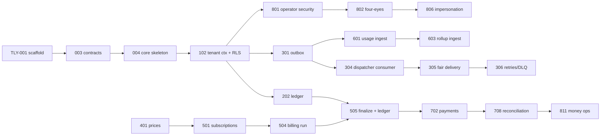

# Delivery Plan

Version 1.0 · 2026-09-22 · Owner: Tech lead

Sprints are 2 weeks. At side-project pace a sprint may stretch to 3 weeks; the order and waves do not change, only the calendar. Every story in docs/06 appears in exactly one sprint below.

Before picking a story's execution workflow, classify it per root CLAUDE.md §4a (Track A —
lightweight, for scaffolding/tooling/shells; Track B — full multi-round review, for anything
touching money/RLS/idempotency/auth/webhook signing). Sprint 0 ran every story through Track
B's ceremony regardless of content, which is the single biggest reason it took far longer
than the work itself warranted (docs/releases/sprint-0.md has the retrospective numbers).
Most of E0 is Track A; most of E2/E5/E7/E8 is Track B.

## 1. Delivery model and capacity

| Lane | Owns | Worked by | Throughput |
| --- | --- | --- | --- |
| PLAT | `contracts/ deploy/ scripts/ .github/ Makefile docs/` | Tech lead + one Claude Code session for suites | ≈ 13 pts/session/sprint |
| CORE | `core/` | Claude Code; up to 2 concurrent sessions when stories touch disjoint modules | ≈ 13 pts/session |
| WORK | `workers/` | Claude Code | ≈ 13 pts |
| WEB | `web/` | Claude Code; up to 2 sessions on disjoint routes | ≈ 13 pts/session |
| OPSW | `ops-web/` | Claude Code; up to 2 sessions on disjoint routes | ≈ 13 pts/session |

The real constraint is **review**: the tech lead reviews ≈ 35 points per sprint. Commitment is therefore ≤ 30 points per sprint (15 % buffer), PRs stay under 400 changed lines, and the last sprint is light. Two sessions in one lane never touch the same package or route; shared files in a lane (`build.gradle.kts`, `application.yml`, `package.json`) change only in the first story of the sprint or through a Ruling.

Load per sprint (points):

| Sprint | PLAT | CORE | WORK | WEB | OPSW | Total | Parallel sessions |
| --- | --- | --- | --- | --- | --- | --- | --- |
| 0 | 15 | 5 | 3 | 5 | 3 | 31 | 6 |
| 1 | 2 | 21 |  | 5 |  | 28 | 4 |
| 2 |  | 26 |  | 3 |  | 29 | 3 |
| 3 |  | 23 | 5 |  |  | 28 | 3 |
| 4 |  | 8 | 13 | 5 |  | 26 | 3 |
| 5 |  |  | 5 | 21 |  | 26 | 3 |
| 6 |  | 21 |  | 5 |  | 26 | 3 |
| 7 |  | 21 |  | 8 |  | 29 | 3 |
| 8 |  | 5 | 8 | 13 |  | 26 | 3 |
| 9 |  | 21 |  | 5 |  | 26 | 3 |
| 10 |  | 23 |  | 5 |  | 28 | 3 |
| 11 |  | 13 |  |  | 13 | 26 | 2 |
| 12 |  | 15 | 5 | 3 | 5 | 28 | 5 |
| 13 | 5 |  |  |  | 21 | 26 | 3 |
| 14 | 15 | 8 |  | 3 |  | 26 | 4 |
| 15 | 3 | 8 |  |  |  | 11 | 2 |

Total: 420 points, 81 stories, 16 sprints (0–15).

## 2. Feature slices

A slice pairs backend and frontend stories on one contract. Both sides build in parallel (frontend on MSW mocks), merge behind the slice flag, pass the integration checkpoint, then the flag turns on in the release listed. Flags are removed one release later.

| Slice | Name | Backend | Frontend | Contract (merged day 1 of the first sprint) | Flag | Release |
| --- | --- | --- | --- | --- | --- | --- |
| S1 | Sign-in & tenant switch | TLY-101, TLY-103 | TLY-104 | `/v1/me`, `/ops/v1/tenants` (create) | `FF_S1_AUTH` | R1 |
| S2 | API keys | TLY-105 | TLY-106 | `/v1/api_keys*` | `FF_S2_API_KEYS` | R1 |
| S3 | Team, branding, plan | TLY-107, TLY-109 | TLY-108 | `/v1/team/*`, `/v1/settings/branding*`, `/v1/account/plan` | `FF_S3_SETTINGS` | R1 |
| S4 | Webhook endpoints & monitor | TLY-303, TLY-307 | TLY-308, TLY-309 | `/v1/webhook_endpoints*`, `/v1/webhook_deliveries*`, `/v1/streams/webhook_deliveries`, webhook-control schema | `FF_S4_WEBHOOKS` | R1 |
| S5 | Events & request logs | TLY-302, TLY-311 | TLY-310 | `/v1/events*`, `/v1/request_logs`, event schemas | `FF_S5_EVENTS` | R1 |
| S6 | Products & pricing | TLY-401 | TLY-402 | `/v1/products*`, `/v1/prices/{id}/archive` | `FF_S6_CATALOG` | R1 |
| S7 | Customers | TLY-403, TLY-404 | TLY-405 | `/v1/customers*` incl. payment methods | `FF_S7_CUSTOMERS` | R2 |
| S8 | Subscriptions | TLY-501, TLY-502 | TLY-503 | `/v1/subscriptions*` incl. preview | `FF_S8_SUBSCRIPTIONS` | R2 |
| S9 | Invoices | TLY-504, TLY-505, TLY-507 | TLY-506 | `/v1/invoices*` | `FF_S9_INVOICES` | R2 |
| S10 | Usage | TLY-601, TLY-602, TLY-603 | TLY-604 | `/v1/usage_events`, `/v1/meters`, `/v1/usage/summary`, usage-raw + usage-rollup schemas | `FF_S10_USAGE` | R2 |
| S11 | Payments | TLY-701, TLY-702, TLY-703, TLY-704 | TLY-705 | `/v1/payments*`, `/v1/refunds`, payment schema | `FF_S11_PAYMENTS` | R3 |
| S12 | Home dashboard | TLY-706 | TLY-707 | `/v1/reports/*`, `/v1/attention-items*` | `FF_S12_HOME` | R3 |
| S13 | Governance | TLY-801, TLY-802 | TLY-803 | `/ops/v1/approvals*`, `/ops/v1/audit*`, `/ops/v1/operators*` | `FF_S13_GOVERNANCE` | R4 |
| S14 | Ops tenants & overview | TLY-804 | TLY-805 | `/ops/v1/overview`, `/ops/v1/tenants*`, `/ops/v1/attention/*` | `FF_S14_OPS_TENANTS` | R4 |
| S15 | Impersonation | TLY-806 | TLY-807, TLY-815 | `/ops/v1/impersonations*`, `/v1/account/impersonations` | `FF_S15_IMPERSONATION` | R4 |
| S16 | Health, fleet, jobs | TLY-808, TLY-810 | TLY-809 | `/ops/v1/health/*`, `/ops/v1/alerts`, `/ops/v1/webhooks/*`, `/ops/v1/replays/*`, `/ops/v1/jobs*` | `FF_S16_HEALTH_FLEET` | R4 |
| S17 | Money ops | TLY-708, TLY-811 | TLY-812 | `/ops/v1/reconciliation/*`, `/ops/v1/refunds`, `/ops/v1/tenants/{id}/ledger/*` | `FF_S17_MONEY_OPS` | R4 |
| S18 | Config ops | TLY-813 | TLY-814 | `/ops/v1/plans*`, `/ops/v1/flags*` | `FF_S18_CONFIG_OPS` | R4 |

Stories outside slices (no user-visible contract of their own): all of E0; TLY-102, 110, 111, 201, 202, 203, 301, 312 (platform and money core); TLY-304, 305, 306 (dispatcher internals); TLY-508 (test clocks, API only); all of E9.

## 3. Sprint plan

`A ∥ B` = concurrent; `A → B` = B starts after A merges. Wave 1 starts on day 1 after the sprint's contract PRs merge.

| Sprint | Goal | Wave 1 ∥ | Wave 2+ | Points | Release |
| --- | --- | --- | --- | --- | --- |
| 0 | Walking skeleton: stack up, contracts pipeline, five skeletons | PLAT 001 | PLAT 002 ∥ PLAT 003 → CORE 004 ∥ WORK 005 ∥ WEB 006 ∥ OPSW 007 | 31 | R0 |
| 1 | Tenants exist and are isolated; users sign in | CORE 101 ∥ CORE 102 ∥ CORE 103 ∥ WEB 104 ∥ CORE 201 ∥ PLAT 312 | — | 28 | — |
| 2 | Safe writes: idempotency, API keys, ledger, outbox | WEB 106 ∥ CORE 110 ∥ CORE 202 ∥ CORE 301 | CORE 105 ∥ CORE 203 | 29 | — |
| 3 | Events flow; endpoints registered; team and catalog | CORE 107 ∥ CORE 109 ∥ CORE 302 ∥ CORE 303 ∥ WORK 304 ∥ CORE 401 | — | 28 | — |
| 4 | Fair, signed webhook delivery with retries; request logs; settings | WEB 108 ∥ CORE 111 ∥ WORK 305 ∥ CORE 311 | WORK 306 | 26 | — |
| 5 | Webhook monitor, events & logs, products UI — R1 | WORK 307 ∥ WEB 308 ∥ WEB 309 ∥ WEB 310 ∥ WEB 402 | — | 26 | R1 |
| 6 | Customers and the subscription engine | CORE 403 ∥ WEB 405 ∥ CORE 502 | CORE 404 ∥ CORE 501 | 26 | — |
| 7 | Invoices drafted, finalized, reminded; usage ingest | WEB 503 ∥ CORE 504 ∥ CORE 601 | CORE 505 ∥ CORE 507 | 29 | — |
| 8 | Invoice UI, usage rollups and explorer — R2 | WEB 506 ∥ WORK 602 ∥ CORE 603 ∥ WEB 604 | — | 26 | R2 |
| 9 | Payments, dunning, refunds and payments UI | CORE 701 ∥ WEB 705 | CORE 702 → CORE 703 ∥ CORE 704 | 26 | — |
| 10 | Home dashboard, reconciliation, operator governance core — R3 | CORE 706 ∥ WEB 707 ∥ CORE 708 ∥ CORE 801 | CORE 802 | 28 | R3 |
| 11 | Operator tenants, approvals UI, impersonation API, test clocks | CORE 508 ∥ OPSW 803 ∥ CORE 804 ∥ OPSW 805 ∥ CORE 806 | — | 26 | — |
| 12 | Impersonation UI, health API, fleet ops, money ops API, plans/flags API | OPSW 807 ∥ CORE 808 ∥ WORK 810 ∥ CORE 811 ∥ CORE 813 ∥ WEB 815 | — | 28 | — |
| 13 | Operator health/fleet/jobs, money and config screens, observability — R4 | OPSW 809 ∥ OPSW 812 ∥ OPSW 814 ∥ PLAT 901 | — | 26 | R4 |
| 14 | Load, chaos and security suites, a11y audit, offboarding | PLAT 902 ∥ PLAT 903 ∥ PLAT 904 ∥ CORE 905 ∥ WEB 909 | — | 26 | — |
| 15 | Silo migration, restore drill, buffer — R5 | CORE 906 ∥ PLAT 910 | — | 11 | R5 |

### 3.1 Sprint cards

**Sprint 0** — Capacity 30 (review) · Committed 31 · Buffer 0  
Stories: TLY-001 Monorepo scaffold, Makefile and CI skeleton (PLAT, 5); TLY-002 Local stack with docker compose (PLAT, 5); TLY-003 Contract pipeline and code generation (PLAT, 5); TLY-004 Core skeleton: Java 25, Spring Boot 4, Spring Modulith (CORE, 5); TLY-005 Workers skeleton: Go 1.27 dispatcher and aggregator (WORK, 3); TLY-006 Web shell, design tokens and mock mode (WEB, 5); TLY-007 Operator console shell (OPSW, 3)  
Risk → mitigation: Toolchain friction on Java 25/Go 1.27 → pin versions first (TLY-001), compose memory check (A-01).

**Sprint 1** — Capacity 30 (review) · Committed 28 · Buffer 2  
Stories: TLY-101 Tenant provisioning and plan versions (CORE, 5); TLY-102 Tenant context and row-level security (CORE, 8); TLY-103 Identity: resource server and /v1/me (CORE, 5); TLY-104 BFF login, session and tenant switcher (WEB, 5); TLY-201 Money value object (CORE, 3); TLY-312 Webhook signing golden vectors and verification guide (PLAT, 2)  
Risk → mitigation: RLS mistakes are silent → `RlsCoverageIT` and fail-closed `current_tenant()` land with TLY-102 before any feature table.

**Sprint 2** — Capacity 30 (review) · Committed 29 · Buffer 1  
Stories: TLY-105 API keys: create once, hash, scope, revoke (CORE, 5); TLY-106 API keys screen (WEB, 3); TLY-110 Idempotency filter and tenant audit log (CORE, 5); TLY-202 Double-entry ledger with enforced balance (CORE, 8); TLY-203 Balances as of a point in time (CORE, 3); TLY-301 Transactional outbox and relay (CORE, 5)  
Risk → mitigation: Ledger trigger performance → throughput AC in TLY-202; review TLY-202 first each day (critical path).

**Sprint 3** — Capacity 30 (review) · Committed 28 · Buffer 2  
Stories: TLY-107 Team members and invitations (CORE, 5); TLY-109 Branding and account plan endpoints (CORE, 3); TLY-302 Event log and Events API (CORE, 5); TLY-303 Webhook endpoints, secrets and SSRF validation (CORE, 5); TLY-304 Dispatcher consumer and delivery messages (WORK, 5); TLY-401 Products and immutable price versions (CORE, 5)  
Risk → mitigation: Dispatcher and core disagree on control events → schema merged day 1; contract test both sides.

**Sprint 4** — Capacity 30 (review) · Committed 26 · Buffer 4  
Stories: TLY-108 Settings screen: team, branding, plan and limits (WEB, 5); TLY-111 Per-tenant rate limiting (CORE, 5); TLY-305 Fair scheduler, signing and SSRF-safe delivery (WORK, 8); TLY-306 Retries, circuit breaker, DLQ and auto-disable (WORK, 5); TLY-311 Request log pipeline and API (CORE, 3)  
Risk → mitigation: Fairness claim unproven → fairness test is an AC of TLY-305, not a later suite.

**Sprint 5** — Capacity 30 (review) · Committed 26 · Buffer 4  
Stories: TLY-307 Deliveries API, replay and live stream (WORK, 5); TLY-308 Webhook monitor screen (WEB, 8); TLY-309 Endpoint management UI (WEB, 3); TLY-310 Events and logs screen (WEB, 5); TLY-402 Products and pricing screen (WEB, 5)  
Risk → mitigation: Frontend-heavy sprint (WEB 21) → two WEB sessions on disjoint routes; integration checkpoint for S4/S5/S6 before R1.

**Sprint 6** — Capacity 30 (review) · Committed 26 · Buffer 4  
Stories: TLY-403 Customers API and timeline (CORE, 5); TLY-404 Payment method setup via processor tokens (CORE, 3); TLY-405 Customers list and Customer 360 screens (WEB, 5); TLY-501 Subscription lifecycle state machine (CORE, 8); TLY-502 Pricing engine, preview and proration (CORE, 5)  
Risk → mitigation: State machine edge cases → table-driven test of all transitions (TLY-501 AC2).

**Sprint 7** — Capacity 30 (review) · Committed 29 · Buffer 1  
Stories: TLY-503 Subscription builder and subscriptions list (WEB, 8); TLY-504 Billing run and draft invoices (CORE, 8); TLY-505 Finalize, void and credit notes with ledger postings (CORE, 5); TLY-507 Invoice reminders (CORE, 3); TLY-601 Usage ingest API (CORE, 5)  
Risk → mitigation: Invoice number gaps under concurrency → 50-parallel finalize test (TLY-505 AC2).

**Sprint 8** — Capacity 30 (review) · Committed 26 · Buffer 4  
Stories: TLY-506 Invoices list and invoice detail screens (WEB, 8); TLY-602 Aggregator windowed rollups (WORK, 8); TLY-603 Rollup ingestion, meters and usage summary (CORE, 5); TLY-604 Usage explorer screen (WEB, 5)  
Risk → mitigation: Aggregator exactly-once under restart → kill -9 AC in TLY-602.

**Sprint 9** — Capacity 30 (review) · Committed 26 · Buffer 4  
Stories: TLY-701 Payment processor port with Stripe test and simulator adapters (CORE, 8); TLY-702 Payments API and async outcome resolution (CORE, 5); TLY-703 Dunning schedules (CORE, 5); TLY-704 Refunds (CORE, 3); TLY-705 Payments screen (WEB, 5)  
Risk → mitigation: Unknown processor outcomes → simulator timeout token + chaos AC in TLY-702.

**Sprint 10** — Capacity 30 (review) · Committed 28 · Buffer 2  
Stories: TLY-706 Reports read models and attention items (CORE, 5); TLY-707 Home dashboard screen (WEB, 5); TLY-708 Daily reconciliation job (CORE, 5); TLY-801 Operator realm, ops API security and hash-chained audit (CORE, 8); TLY-802 Four-eyes approval framework (CORE, 5)  
Risk → mitigation: Operator security designed late → TLY-801 before any ops screen; RBAC matrix as code.

**Sprint 11** — Capacity 30 (review) · Committed 26 · Buffer 4  
Stories: TLY-508 Test clocks (CORE, 3); TLY-803 Approvals, audit log and operators screens (OPSW, 8); TLY-804 Ops tenants API and overview (CORE, 5); TLY-805 Ops tenants and overview screens (OPSW, 5); TLY-806 Impersonation with token exchange (CORE, 5)  
Risk → mitigation: Impersonation token leakage → token never stored in ops-web; TTL = session.

**Sprint 12** — Capacity 30 (review) · Committed 28 · Buffer 2  
Stories: TLY-807 Impersonation console screens (OPSW, 5); TLY-808 Platform health API and rate-limit overrides (CORE, 5); TLY-810 Fleet, DLQ replay and job ops APIs (WORK, 5); TLY-811 Reconciliation, refunds and ledger explorer ops APIs (CORE, 5); TLY-813 Plans, limits and feature flags ops API (CORE, 5); TLY-815 Impersonation banner and history in the tenant app (WEB, 3)  
Risk → mitigation: Many small ops APIs → one contract PR per slice (S15–S18) on day 1.

**Sprint 13** — Capacity 30 (review) · Committed 26 · Buffer 4  
Stories: TLY-809 Health, webhook fleet and jobs screens (OPSW, 8); TLY-812 Recon, refunds and ledger explorer screens (OPSW, 8); TLY-814 Plans and flags screens (OPSW, 5); TLY-901 Observability: traces, dashboards, SLOs and runbooks (PLAT, 5)  
Risk → mitigation: OPSW load 21 → two OPSW sessions; observability dashboards may slip to Sprint 14 buffer.

**Sprint 14** — Capacity 30 (review) · Committed 26 · Buffer 4  
Stories: TLY-902 Load suite with skewed tenants (PLAT, 5); TLY-903 Chaos and resilience suite (PLAT, 5); TLY-904 Security suite: cross-tenant, SSRF, secrets, DAST (PLAT, 5); TLY-905 Tenant data export and crypto-shred offboarding (CORE, 8); TLY-909 Accessibility and motion audit (WEB, 3)  
Risk → mitigation: Suites find real bugs late → fix stories take priority over new scope; Sprint 15 is buffer.

**Sprint 15** — Capacity 30 (review) · Committed 11 · Buffer 19  
Stories: TLY-906 Pool to silo live migration (CORE, 8); TLY-910 Backup, restore and zero-downtime migration drill (PLAT, 3)  
Risk → mitigation: Silo migration complexity → time-boxed; if not done, R5 ships without it (documented in release notes).

## 4. Dependencies and critical path



Critical path (longest chain to the riskiest capability, money correctness end to end): **001 → 003 → 004 → 102 → 202 → 505 → 702 → 708 → 811**. Protect it: its stories get the first review slot each day and no scope is added to them mid-sprint. The second chain (**102 → 301 → 304 → 305 → 306**) carries the fairness risk and gets the second slot.

## 5. Definition of Ready

- Testable numbered AC; lane, points, slice, dependencies and traces set in docs/06.
- Contract changes identified and scheduled in the sprint's day-1 contract PR.
- Referenced sections of docs/02–05 exist and agree (else a doc-fix PR first).
- Migration number reserved (docs/05 §5) for stories that change a schema.
- Test approach known (unit, Testcontainers, contract, E2E journey id from docs/08).
- No open design question; otherwise the plan starts with **brainstorming** and the tech lead signs off.

## 6. Definition of Done

**Story:** every AC proven by a named test; `make lint test contracts` green; gitleaks and dependency scan clean; logs/metrics/traces added; docs updated in the same PR; code review done; plan kept in `docs/plans/<ID>.md`.
**Slice:** both sides merged behind the flag; integration checkpoint passed (`make up FLAGS=<flag>=true && make e2e`, mocks off); 30-second demo clip attached to the slice issue.
**Release:** tag `vX.Y.0`; release notes from Conventional Commits; flags of the previous release removed; docs/09 risks reviewed; load smoke (`make load`) green.

## 7. Branching, versioning and flags

- Trunk-based. Branches `feat|fix|chore/<ID>-<slug>` live ≤ 3 days; `contract/<slice>-<slug>` merges first each sprint.
- Squash merge with `type(scope): summary (TLY-nnn)`; scope = `plat|core|work|web|opsw|contracts`.
- SemVer for the product (R1 = v0.1.0 … R5 = v0.5.0); URL major version for APIs; `api_version` date for events; webhook spec versioned in docs/03.
- Slice flags `FF_<SLICE>_<NAME>` default off in every environment; enabled per release in `deploy/flags/<release>.env`.

## 8. Pull requests

Template: `.github/pull_request_template.md` (story line, what/why, AC → test table, checklist, plan link). CODEOWNERS routes every lane to the tech lead. PR size ≤ 400 changed lines excluding generated code; larger stories open a draft PR after the first task.

## 9. Ceremonies (solo-friendly)

| Ceremony | When | Output |
| --- | --- | --- |
| Sprint planning | Day 1, 60 min | Contract PRs opened; sessions assigned per lane (§10 prompts) |
| Daily review block | Every day, first 90 min | Review queue emptied, critical path first |
| Integration checkpoint | When both sides of a slice merge | Checkpoint report in the slice issue |
| Sprint review | Last day, 30 min | Demo clips, release notes draft |
| Retro | Last day, 20 min | Metrics in §11, one process change |

## 10. Claude Code playbook

Sprint start (tech lead, on main):
```
Read docs/07 §3 for Sprint <n> and its stories in docs/06. For each slice starting this sprint, draft the
contract PR: edit only scripts/gen_openapi.py or scripts/gen_events.py tables, run `make contracts`.
Use writing-plans, then verification-before-completion (paste `make contracts` output). One PR per slice.
Do not touch service code.
```

Lane session (one terminal per lane or sub-lane, after contracts merge):
```
You are the <LANE> lane. Story: <ID>. Read CLAUDE.md, <service>/CLAUDE.md, the story in docs/06 and every
doc section it traces to. Follow CLAUDE.md §4: using-git-worktrees (feat/<ID>-<slug>), writing-plans
(docs/plans/<ID>.md, reserve migration numbers), subagent-driven-development + test-driven-development,
verification-before-completion, requesting-code-review, finishing-a-development-branch.
Edit only <service>/ and docs/plans/. If a contract or another lane must change, stop and write a Ruling
in the plan for the tech lead.
```

Parallel dispatch inside a story (dispatching-parallel-agents): only for tasks with disjoint files; each subagent brief = task, files it may edit, the failing test to write first, the verification command, the return format.

Integration checkpoint (tech lead):
```
Slice <S>: both sides merged. Run `make up FLAGS=<FLAG>=true` with NEXT_PUBLIC_API_MODE=live, then
`make e2e -- --grep @<S>` and the provider contract tests. On failure use systematic-debugging, identify
which side violates contracts/, open a fix story for that lane. Report with command output.
```

Merge order inside a sprint: contracts → providers → consumers → flag on.

## 11. Tracking

Board columns: Backlog → Ready → In progress (per lane) → In review → Merged (flag off) → Released.

| Metric | Target | Source |
| --- | --- | --- |
| Committed vs done points | ≥ 85 % | board |
| Review queue age | < 1 day | GitHub PR age |
| Cross-lane file conflicts | ≤ 1 per sprint | merge conflicts touching another lane |
| Frontend days blocked by backend | 0 | slice issues |
| CI red time on main | < 2 h per sprint | Actions |
| Escaped defects (found after flag on) | ≤ 2 per release | issues labeled `escaped` |
| Contract breaks caught by oasdiff | tracked, not targeted | CI |
